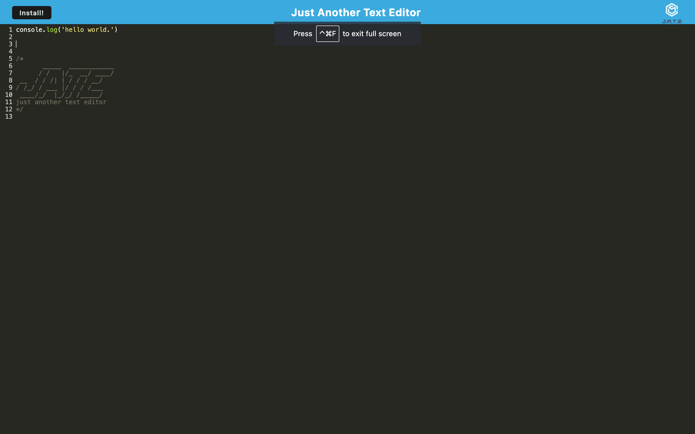

# Text-Editor

## Description 
This is a Progressive Web Application that serves as a text editor, allowing developers to create notes or code with or without an internet connection. 

## Table of Contents 
- [Installation](#Installation)
- [Usage](#Usage)
- [License](#License)
- [Contributing](#Contributing)
- [Tests](#Tests)
- [Questions](#Questions)

## Installation 
To install this project, please clone the repoository to your local machine and run 'npm install' to install the necessary dependencies. 

## Usage
To use this project, open the application, enter notes or code into the text editor. Click away from the text editor or close the window and the content will automatically be saved. Reopen the application, and your content will be retrieved from IndexedD Click the "Install" button to add the application as an icon to your desktop.

## License 
This project is licensed under the MIT License.

## Questions
GitHub Profile: [bwolson31](https://github.com/bwolson31)

For additional questions, contact me via email: bwolson31@gmail.com

